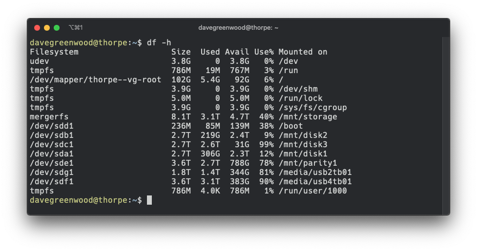
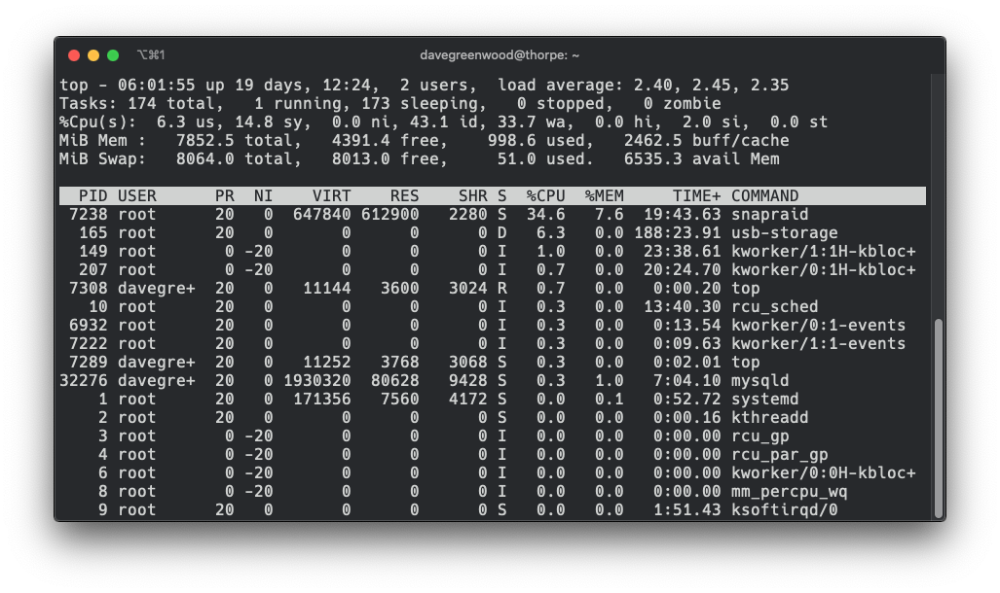

# Useful Linux Commands

Some common Linux terminal commands, that I use often.

## Disk Usage

To check the free disk space, use the `df` command.

With no flag it produces output for all disks, reporting in (e.g 1k) block sizes.
The `-h` flag gives human readable output:

Passing a directory argument reports the free disk space for the drive the directory is on.

To get disk usage, the `du` command is used. This also accepts the `-h` flag for
human readable output and also a summary option with `-s`.

Used with a directory argument gives the disk space used just for that
directory and all it's subdirectories. eg: `du -hs ./` reports disk usage for the current directory.

## Running Processes

To get a quick over view of running processes use `top`:

